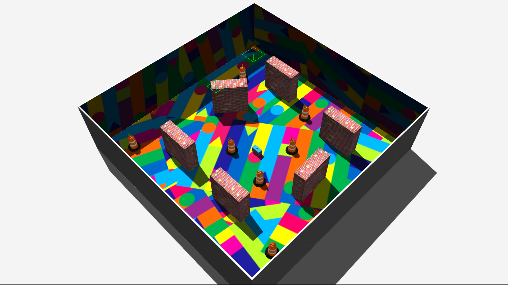
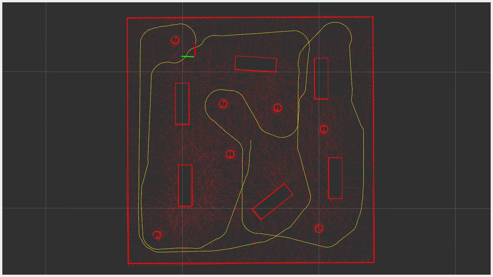
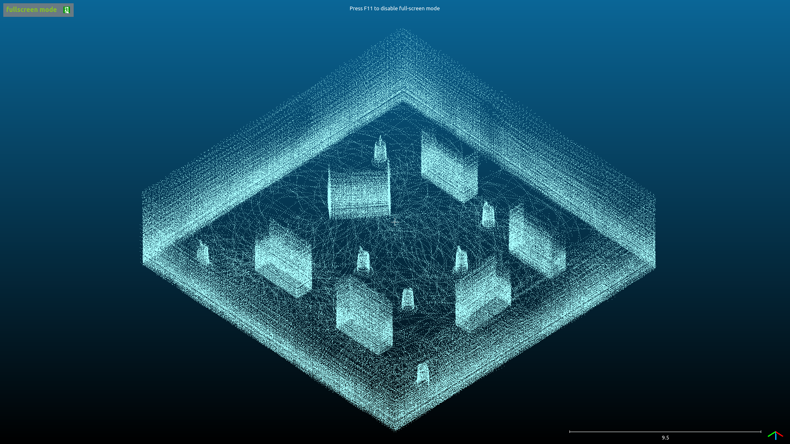

# LIDAR-SLAM-Robot

ROS 2 Packages for Testing LIDAR-SLAM on a Robotic Vehicle with 3D LIDAR.

|  |  |  |
|:--------:|:--------:|:--------:|
| Robot Simulation (Gazebo) | Real-Time Data Visualization (RViz) | Saved PCD Map Visualization & Post-Processing (CloudCompare) |

## Install

  ```
  cd ~/ROS2_WS/src
  git clone https://github.com/Tinker-Twins/LIDAR-SLAM-Robot.git
  cd ..
  rosdep install --from-paths src --ignore-src -r -y
  colcon build --cmake-args -DCMAKE_BUILD_TYPE=Release
  ```

## Execute

1. Launch simulation:
```
ros2 launch robot_gazebo robot_sim.launch.py
```

2. Run the teleoperation node:
```
ros2 run teleop_twist_keyboard teleop_twist_keyboard
```

3. Launch LIDAR-SLAM node:
```
ros2 launch lidarslam lidarslam.launch.py
```

4. Launch RViz and load the [`mapping.rviz`](lidarslam/rviz/mapping.rviz) configuration:
```
rviz2
```
**Note:** Teleoperate the robot around the environment until a satisfactory map is built.

4. Save the PCD map:
```
ros2 service call /map_save std_srvs/Empty
```
**Note:** Map files will be saved to the path pointed by the current terminal window.

## Similar Repositories:

https://github.com/Tinker-Twins/LIO-SAM-Robot
